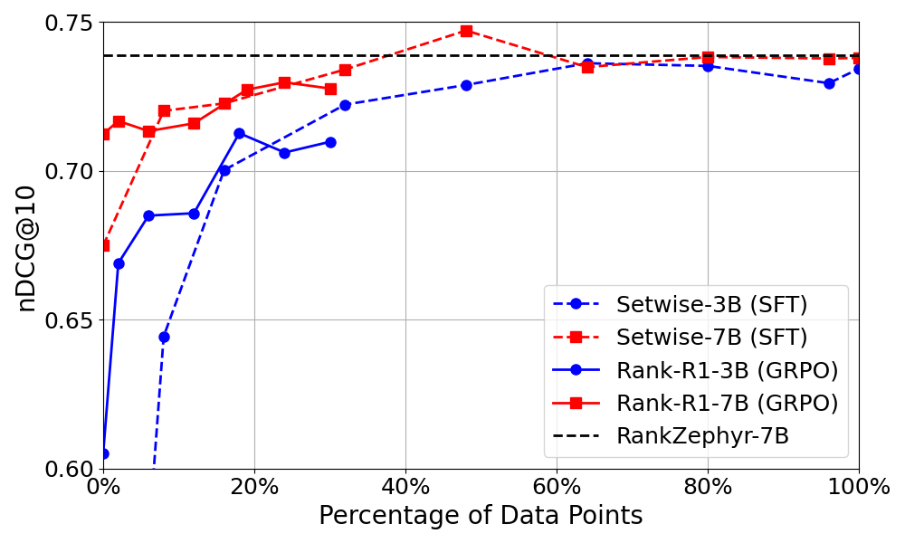
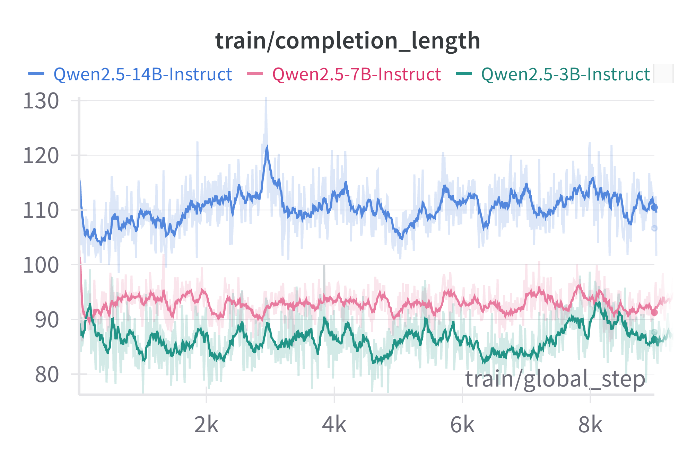
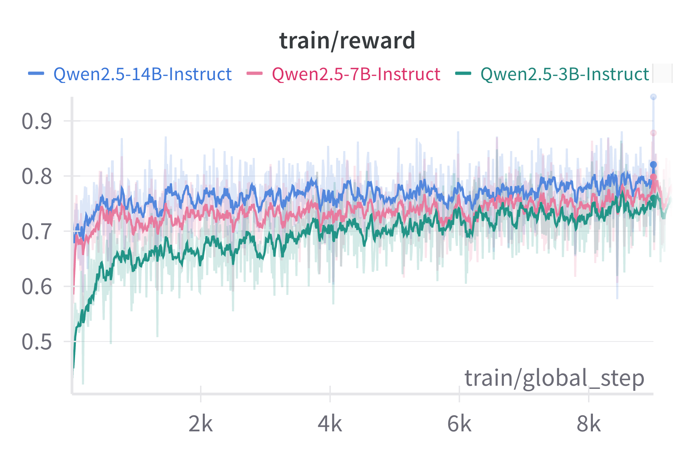
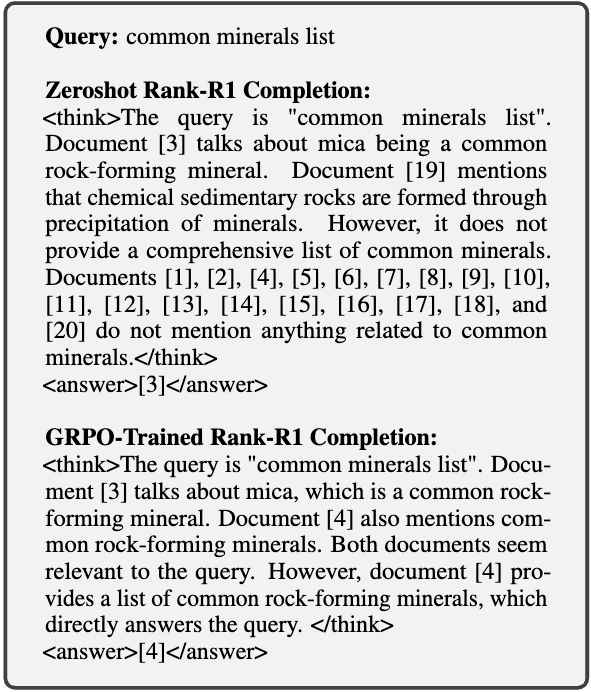

# Rank-R1
Rank-R1 code see Rank-R1 folder.

## Effect of quantity of training data


The results in Table1 for Rank-R1 trained with GRPO are obtained when using only 18\% of the MSMARCO training data (while SFT used all available training data). To explore whether longer training could further improve effectiveness, we continued training the 3B and 7B Rank-R1 models for an additional two days and evaluated checkpoints saved during training. We report the results in above figure. In the figure, we also include results obtained when using SFT on incremental parts of the training data. 

From the figure, we observe that Rank-R1 requires significantly less data than Setwise SFT to achieve the same level of performance at early training stage -- however this data efficiency effect vanishes early on during the training phase. Passed 5-7\% of training data, in fact, the two training approaches tend to track each other. SFT has a clear advantage over GRPO in that it is by far less computationally expensive. On the other hand, GRPO adds new features to the reranker, introducing the ability to perform reasoning.


## Reward score v.s. Response length
<p align="center">
  
  
</p>

In above figure, we present the received reward values and model completion lengths logged during training for Rank-R1, across different model sizes. Rewards consistently increase throughout training, with smaller models showing a higher rate of increase, while larger models start with a higher initial reward.

Regarding completion length, larger models tend to generate longer responses; however, we do not observe a noticeable increase in length as training proceeds. This observation differs from the findings for DeepSeek-R1. This may be attributed to two factors. First, we initialize RL training from an instruction-tuned model rather than a base model, meaning the instruction model already follows a reasonable reasoning process. Second, the MSMARCO passage ranking dataset is relatively simple compared to tasks like math or coding, where a longer reasoning process is more essential. Thus, extensive reasoning may not be necessary for achieving high effectiveness in this task.

## Case study

In above figure, we provide an example of Rank-R1's generation. We compare the outputs of the Zeroshot model and the model after GPRO training. Both models successfully follow the instruction by providing a reasoning process within the <think> span and predicting a relevant document label in the correct format. However, the Zeroshot model tends to merely describe what each document mentions and ultimately makes an incorrect prediction. In contrast, the GPRO-trained model focuses on the most relevant documents, compares them, and correctly selects the best one. In addition, we argue that Rank-R1's transparent reasoning process makes its predictions more explainable, which could be particularly important in domains such as medical document ranking.

---
## Installation
Install via PyP
```bash
pip install llm-rankers
```
Or typically for development and research, clone this repo and install as editable,
```bash
git clone https://github.com/ielab/llm-rankers.git
cd llm-rankers
pip install -e .
```

The code is tested with the following dependencies:
```bash
torch==2.0.1
transformers==4.31.0
pyserini==0.21.0
ir-datasets==0.5.5
openai==0.27.10
tiktoken==0.4.0
accelerate==0.22.0 
```
> Note the code base is tested with python=3.9 conda environment. You may also need to install some pyserini dependencies such as faiss. We refer to pyserini installation doc [link](https://github.com/castorini/pyserini/blob/master/docs/installation.md#development-installation)

---

## Python code example:

```Python
from llmrankers.setwise import SetwiseLlmRanker
from llmrankers.rankers import SearchResult

docs = [SearchResult(docid=i, text=f'this is passage {i}', score=None) for i in range(100)]
query = 'Give me passage 34'

ranker = SetwiseLlmRanker(model_name_or_path='google/flan-t5-large',
                          tokenizer_name_or_path='google/flan-t5-large',
                          device='cuda',
                          num_child=10,
                          scoring='generation',
                          method='heapsort',
                          k=10)

print(ranker.rerank(query, docs)[0])
```
---

## Experiment examples (TREC DL and BEIR)
### First-stage runs
We use LLMs to re-rank top documents retrieved by a first-stage retriever. In this repo we take BM25 as the retriever.

We rely on [pyserini](https://github.com/castorini/pyserini) IR toolkit to get BM25 ranking. 

Here is an example of using pyserini command lines to generate BM25 run files on TREC DL 2019:
```bash
python -m pyserini.search.lucene \
  --threads 16 --batch-size 128 \
  --index msmarco-v1-passage \
  --topics dl19-passage \
  --output run.msmarco-v1-passage.bm25-default.dl19.txt \
  --bm25 --k1 0.9 --b 0.4
```
To evaluate NDCG@10 scores of BM25:

```bash
python -m pyserini.eval.trec_eval -c -l 2 -m ndcg_cut.10 dl19-passage \
  run.msmarco-v1-passage.bm25-default.dl19.txt
  
Results:
ndcg_cut_10           	all	0.5058
```

You can find the command line examples for full TREC DL datasets [here](https://castorini.github.io/pyserini/2cr/msmarco-v1-passage.html).

Similarly, you can find command lines for obtaining BM25 results on BEIR datasets [here](https://castorini.github.io/pyserini/2cr/beir.html).

In this repository, we use DL 2019 as an example. That is, we always re-rank `run.msmarco-v1-passage.bm25-default.dl19.txt` with LLMs.

--- 

### Re-rank first stage run with LLMs

<details>
<summary>Pointwise</summary>
We have two pointwise methods implemented so far:

`yes_no`: LLMs are prompted to generate whether the provided candidate document is relevant to the query. Candidate documents are re-ranked based on the normalized likelihood of generating a "yes" response.

`qlm`: Query Likelihood Modelling (QLM), LLMs are prompted to produce a relevant query for each candidate document. The documents are then re-ranked based on the likelihood of generating the given query. [1]

These methods rely on access to the model output logits to compute relevance scores.

Command line example:
```bash
CUDA_VISIBLE_DEVICES=0 python3 run.py \
  run --model_name_or_path google/flan-t5-large \
      --tokenizer_name_or_path google/flan-t5-large \
      --run_path run.msmarco-v1-passage.bm25-default.dl19.txt \
      --save_path run.pointwise.yes_no.txt \
      --ir_dataset_name msmarco-passage/trec-dl-2019 \
      --hits 100 \
      --query_length 32 \
      --passage_length 128 \
      --device cuda \
  pointwise --method yes_no \
            --batch_size 32
```   
```bash     
# evaluation
python -m pyserini.eval.trec_eval -c -l 2 -m ndcg_cut.10 dl19-passage \
  run.pointwise.qlm.txt
 
Results:
ndcg_cut_10             all     0.6544
```

Change `--method yes_no` to `--method qlm` for QLM pointwise ranking. You can also set larger `--batch_size` that you gpu can afford for faster inference.

We also have implemented supervised [monoT5](https://github.com/castorini/pygaggle) pointwise re-ranker. Simply set `--model_name_or_path` and `--tokenizer_name_or_path` to `castorini/monot5-3b-msmarco`, or other monoT5 models listed in [here](https://huggingface.co/castorini).

</details>


<details>
<summary>Listwise</summary>

Our implementation of listwise approach is following [RankGPT](https://github.com/sunnweiwei/RankGPT) [2]. It uses a sliding window sorting algorithm to re-rank documents.
```bash
CUDA_VISIBLE_DEVICES=0 python3 run.py \
  run --model_name_or_path google/flan-t5-large \
      --tokenizer_name_or_path google/flan-t5-large \
      --run_path run.msmarco-v1-passage.bm25-default.dl19.txt \
      --save_path run.liswise.generation.txt \
      --ir_dataset_name msmarco-passage/trec-dl-2019 \
      --hits 100 \
      --query_length 32 \
      --passage_length 100 \
      --scoring generation \
      --device cuda \
  listwise --window_size 4 \
           --step_size 2 \
           --num_repeat 5
```

```bash     
# evaluation
python -m pyserini.eval.trec_eval -c -l 2 -m ndcg_cut.10 dl19-passage \
  run.liswise.generation.txt
 
Results:
ndcg_cut_10             all     0.5612
```

Use `--window_size`, `--step_size` and `--num_repeat` to configure sliding window process. 

We also provide Openai API implementation, simply do:

```bash
python3 run.py \
  run --model_name_or_path gpt-3.5-turbo \
      --openai_key [your key] \
      --run_path run.msmarco-v1-passage.bm25-default.dl19.txt \
      --save_path run.iswise.generation.openai.txt \
      --ir_dataset_name msmarco-passage/trec-dl-2019 \
      --hits 100 \
      --query_length 32 \
      --passage_length 100 \
      --scoring generation \
  listwise --window_size 4 \
           --step_size 2 \
           --num_repeat 5
```

The above two listwise runs are relying on LLM generated tokens to do the sliding window. 
However, if we have local model, for example flan-t5, we can use Setwise prompting proposed in our [paper](https://arxiv.org/abs/2310.09497) [3] to estimate the likehood of document rankings to do the sliding window:

```bash
CUDA_VISIBLE_DEVICES=0 python3 run.py \
  run --model_name_or_path google/flan-t5-large \
      --tokenizer_name_or_path google/flan-t5-large \
      --run_path run.msmarco-v1-passage.bm25-default.dl19.txt \
      --save_path run.liswise.likelihood.txt \
      --ir_dataset_name msmarco-passage/trec-dl-2019 \
      --hits 100 \
      --query_length 32 \
      --passage_length 100 \
      --scoring likelihood \
      --device cuda \
  listwise --window_size 4 \
           --step_size 2 \
           --num_repeat 5
```

```bash     
# evaluation
python -m pyserini.eval.trec_eval -c -l 2 -m ndcg_cut.10 dl19-passage \
  run.liswise.likelihood.txt
 
Results:
ndcg_cut_10             all     0.6691
```

</details>

<details>
<summary>Pairwise</summary>
We implement Pairwise prompting method proposed in [4].

```bash
CUDA_VISIBLE_DEVICES=0 python3 run.py \
  run --model_name_or_path google/flan-t5-large \
      --tokenizer_name_or_path google/flan-t5-large \
      --run_path run.msmarco-v1-passage.bm25-default.dl19.txt \
      --save_path run.pairwise.heapsort.txt \
      --ir_dataset_name msmarco-passage/trec-dl-2019 \
      --hits 100 \
      --query_length 32 \
      --passage_length 128 \
      --scoring generation \
      --device cuda \
  pairwise --method heapsort \
           --k 10
```

```bash     
# evaluation
python -m pyserini.eval.trec_eval -c -l 2 -m ndcg_cut.10 dl19-passage \
  run.pairwise.heapsort.txt
 
Results:
ndcg_cut_10             all     0.6571
```

`--method heapsort` does pairwise inferences with heap sort algorithm. Change to `--method bubblesort` for bubble sort algorithm. 
You can set `--method allpair` for comparing all possible pairs. In this case you can set `--batch_size` for batching inference. But `allpair` is very expensive.

We also have supervised [duoT5](https://github.com/castorini/pygaggle) pairwise ranking model implemented.
Simply set `--model_name_or_path` and `--tokenizer_name_or_path` to `castorini/duot5-3b-msmarco`, or other duoT5 models listed in [here](https://huggingface.co/castorini).

</details>

<details>
<summary>Setwise</summary>

Our proposed Setwise prompting can considerably speed up the sorting-based Pairwise methods. Check our paper [here](https://arxiv.org/abs/2310.09497) for more details.  

```bash
CUDA_VISIBLE_DEVICES=0 python3 run.py \
  run --model_name_or_path google/flan-t5-large \
      --tokenizer_name_or_path google/flan-t5-large \
      --run_path run.msmarco-v1-passage.bm25-default.dl19.txt \
      --save_path run.setwise.heapsort.txt \
      --ir_dataset_name msmarco-passage/trec-dl-2019 \
      --hits 100 \
      --query_length 32 \
      --passage_length 128 \
      --scoring generation \
      --device cuda \
  setwise --num_child 2 \
          --method heapsort \
          --k 10
```

```bash     
# evaluation
python -m pyserini.eval.trec_eval -c -l 2 -m ndcg_cut.10 dl19-passage \
  run.setwise.heapsort.txt
 
Results:
ndcg_cut_10             all     0.6697
```

`--num_child 2` means comparing two child node documents + one parent node document = 3 documents in total to compare in the prompt.
increasing `--num_child` will give more efficiency gain, but you may need to truncate documents more by setting a small `--passage_length`, otherwise prompt may exceed input limitation.
You can also set `--scoring likelihood` for faster inference.

We also have Openai API implementation for Setwise method:

```bash
python3 run.py \
  run --model_name_or_path gpt-3.5-turbo \
      --openai_key [your key] \
      --run_path run.msmarco-v1-passage.bm25-default.dl19.txt \
      --save_path run.setwise.heapsort.openai.txt \
      --ir_dataset_name msmarco-passage/trec-dl-2019 \
      --hits 100 \
      --query_length 32 \
      --passage_length 128 \
      --scoring generation \
  setwise --num_child 2 \
          --method heapsort \
          --k 10
```

</details>

<details>
<summary>BEIR experiments</summary>

For BEIR datasets experiments, change `--ir_dataset_name` to `--pyserini_index` with pyserini pre-build index.

For example:

```bash
DATASET=trec-covid # change to: trec-covid robust04 webis-touche2020 scifact signal1m trec-news dbpedia-entity nfcorpus for other experiments in the paper.

# Get BM25 first stage results
python -m pyserini.search.lucene \
  --index beir-v1.0.0-${DATASET}.flat \
  --topics beir-v1.0.0-${DATASET}-test \
  --output run.bm25.${DATASET}.txt \
  --output-format trec \
  --batch 36 --threads 12 \
  --hits 1000 --bm25 --remove-query

python -m pyserini.eval.trec_eval \
  -c -m ndcg_cut.10 beir-v1.0.0-${DATASET}-test \
  run.bm25.${DATASET}.txt

Results:
ndcg_cut_10             all     0.5947

# Setwise with heapsort
CUDA_VISIBLE_DEVICES=0 python3 run.py \
  run --model_name_or_path google/flan-t5-large \
      --tokenizer_name_or_path google/flan-t5-large \
      --run_path run.bm25.${DATASET}.txt \
      --save_path run.setwise.heapsort.${DATASET}.txt \
      --pyserini_index beir-v1.0.0-${DATASET} \
      --hits 100 \
      --query_length 32 \
      --passage_length 128 \
      --scoring generation \
      --device cuda \
  setwise --num_child 2 \
          --method heapsort \
          --k 10

python -m pyserini.eval.trec_eval \
  -c -m ndcg_cut.10 beir-v1.0.0-${DATASET}-test \
  run.setwise.heapsort.${DATASET}.txt

Results:
ndcg_cut_10             all     0.7675
```
</details>

> Note: If you remove CUDA_VISIBLE_DEVICES=0, our code should automatically perform multi-GPU inference, but we may observe slight changes in the NDCG@10 scores

